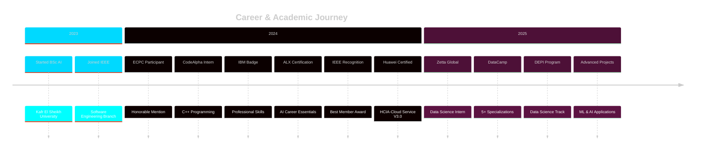

<div align="center">

<!-- 3D Animated Header -->


<!-- Matrix-style Typing Animation -->
[](https://git.io/typing-svg)

<!-- Animated Separator -->


<!-- Quick Stats Cards -->
<p align="center">
  
  
  
</p>

<!-- Real-time GitHub Stats -->
<a href="https://github.com/Nadercr7">
  
</a>
<a href="https://github.com/Nadercr7">
  
</a>

</div>

---

<!-- About Section with Code Style -->
<div align="center">
  
##  About Me

</div>


```python
#!/usr/bin/env python3
# -*- coding: utf-8 -*-

from dataclasses import dataclass
from typing import List, Dict

@dataclass
class DataScientist:
    """A passionate AI engineer building the future"""
    
    name: str = "Nader Mohamed"
    role: str = "AI Engineer & Data Scientist"
    location: str = "🇪🇬 Desouk, Egypt"
    education: str = "BSc AI @ Kafr El Sheikh University"
    company: str = "💼 Zetta Global"
    
    languages: List[str] = ["Python", "C++", "SQL"]
    
    def get_tech_stack(self) -> Dict[str, List[str]]:
        return {
            "ai_ml": [
                "TensorFlow", "PyTorch", "Scikit-learn",
                "Keras", "Hugging Face Transformers"
            ],
            "data_science": [
                "Pandas", "NumPy", "Matplotlib", 
                "Seaborn", "Plotly"
            ],
            "domains": [
                "Deep Learning", "Computer Vision", "NLP",
                "Data Analysis", "Predictive Modeling"
            ],
            "tools": [
                "Git", "Docker", "Jupyter", "VS Code",
                "Google Colab", "Linux"
            ]
        }
    
    def current_mission(self) -> List[str]:
        return [
            "🔬 Researching advanced ML/DL architectures",
            "📊 Building production-ready data pipelines",
            "🤖 Developing AI-powered applications",
            "🏆 Mastering competitive programming",
            "🌱 Contributing to open-source AI projects"
        ]
    
    def get_achievements(self) -> Dict[str, str]:
        return {
            "🥇 HCIA-Cloud": "Huawei Certified",
            "🏆 ECPC 2024": "Honorable Mention",
            "⭐ IEEE Award": "Best Member",
            "📊 DataCamp": "5+ Certifications",
            "🧠 ALX AI": "Career Essentials"
        }

# Initialize
nader = DataScientist()

# Welcome message
print(f"👋 Welcome to {nader.name}'s GitHub Profile!")
print(f"🎯 Currently: {nader.role} @ {nader.company}")
print(f"💡 Mission: Building intelligent solutions with AI & Data Science")
```

<br clear="right"/>


<!-- Tech Stack with Categories -->
<div align="center">

##  Tech Stack & Tools

<!-- Programming Languages -->
<h3>💻 Programming Languages</h3>


<!-- AI/ML Frameworks -->
<h3>🧠 AI & Machine Learning</h3>


<!-- Data Science Stack -->
<h3>📊 Data Science & Visualization</h3>


<!-- Tools & Platforms -->
<h3>🛠️ Development Tools</h3>


<!-- Version Control & Deployment -->
<h3>🚀 DevOps & Cloud</h3>


<!-- Databases & Backend -->
<h3>🗄️ Databases & Backend</h3>


</div>


<!-- Featured Projects with Enhanced Design -->
<div align="center">

##  Featured Projects

</div>

<table>
<tr>
<td width="50%" valign="top">

<div align="center">

### 🔮 Horus AI - Ancient Egyptian Recognition
 

</div>

**Tech Stack:**  
`TensorFlow` · `Keras` · `Flask` · `CNN` · `Transfer Learning`

**🎯 Highlights:**
- ✅ Built CNN model with transfer learning for artifact classification
- ✅ Integrated Google Gemini AI for historical context
- ✅ Developed full-stack web application with Flask
- ✅ Created responsive UI with HTML/CSS
- ✅ Achieved 80% classification accuracy

**💡 Impact:** Revolutionizing cultural heritage preservation through AI

<div align="center">

[](https://github.com/Nadercr7)

</div>

</td>
<td width="50%" valign="top">

<div align="center">

### 🧠 Cerebral Stroke Prediction System
 

</div>

**Tech Stack:**  
`Python` · `Scikit-learn` · `Logistic Regression` · `KNN` · `tkinter`

**🎯 Highlights:**
- ✅ Custom ML algorithms from scratch
- ✅ Advanced class imbalance handling techniques
- ✅ Interactive GUI for real-time predictions
- ✅ Comprehensive model evaluation metrics
- ✅ 85% prediction accuracy

**💡 Impact:** Enabling early stroke detection to save lives

<div align="center">

[](https://github.com/Nadercr7)

</div>

</td>
</tr>
<tr>
<td width="50%" valign="top">

<div align="center">

### 💬 Sentiment Alignment Analysis
 

</div>

**Tech Stack:**  
`BERT` · `Transformers` · `NLP` · `Python` · `Pandas`

**🎯 Highlights:**
- ✅ Multilingual BERT model implementation
- ✅ Sentiment vs rating correlation analysis
- ✅ Advanced data visualization dashboards
- ✅ CSV reporting with detailed insights
- ✅ Pattern discovery in customer feedback

**💡 Impact:** Understanding customer sentiment at scale

<div align="center">

[](https://github.com/Nadercr7)

</div>

</td>
<td width="50%" valign="top">

<div align="center">

### 🎬 Movies Dataset Analysis
 

</div>

**Tech Stack:**  
`Python` · `SQL` · `Pandas` · `Matplotlib` · `Data Analytics`

**🎯 Highlights:**
- ✅ Analyzed 10,000+ movies dataset
- ✅ 20% SQL query performance optimization
- ✅ Discovered 15% actor-revenue correlation
- ✅ Built comprehensive data pipeline
- ✅ Created interactive visualizations

**💡 Impact:** Data-driven insights for entertainment industry

<div align="center">

[](https://github.com/Nadercr7)

</div>

</td>
</tr>
</table>


<!-- GitHub Analytics Section -->
<div align="center">

##  GitHub Analytics

<!-- Contribution Snake -->
<picture>
  <source media="(prefers-color-scheme: dark)" srcset="https://raw.githubusercontent.com/Nadercr7/Nadercr7/output/github-contribution-grid-snake-dark.svg">
  <source media="(prefers-color-scheme: light)" srcset="https://raw.githubusercontent.com/Nadercr7/Nadercr7/output/github-contribution-grid-snake.svg">
  
</picture>

<br/><br/>

<!-- Stats Cards -->


<!-- Language & Activity -->


<!-- Trophy Case -->
<br/>


</div>


<!-- Achievements & Certifications -->
<div align="center">

##  Achievements & Certifications

<table>
<tr>
<td align="center" width="20%">

<br/><br/>
<strong>HCIA-Cloud Service</strong>
<br/><sub>Huawei</sub>
<br/><sub>Dec 2024</sub>
<br/><br/>

</td>
<td align="center" width="20%">

<br/><br/>
<strong>ECPC 2024</strong>
<br/><sub>Honorable Mention</sub>
<br/><sub>July 2024</sub>
<br/><br/>

</td>
<td align="center" width="20%">

<br/><br/>
<strong>DataCamp Pro</strong>
<br/><sub>5+ Certifications</sub>
<br/><sub>2025</sub>
<br/><br/>

</td>
<td align="center" width="20%">

<br/><br/>
<strong>IEEE Best Member</strong>
<br/><sub>Software Engineering</sub>
<br/><sub>2024</sub>
<br/><br/>

</td>
<td align="center" width="20%">

<br/><br/>
<strong>AI Career Essentials</strong>
<br/><sub>ALX × AICE</sub>
<br/><sub>Aug 2024</sub>
<br/><br/>

</td>
</tr>
</table>

### 📜 Complete Certification List

```yaml
Cloud Computing:
  - 🥇 HCIA-Cloud Service V3.0 (Huawei) - Dec 2024

Data Science & AI:
  - 📊 AI Fundamentals (DataCamp) - 2025
  - 🐍 Intermediate Python (DataCamp) - 2025
  - 🐍 Introduction to Python (DataCamp) - 2025
  - 🗃️ Intermediate SQL (DataCamp) - 2025
  - 🗃️ Introduction to SQL (DataCamp) - 2025
  - 🤖 AI Career Essentials (ALX × AICE) - Aug 2024

Programming:
  - 💻 C++ Virtual Internship (CodeAlpha) - Aug 2024

Professional Skills:
  - 🧠 IBM Professional Skills Badge - May 2024
  - 💡 Critical & Creative Thinking (IBM)

Competitive Programming:
  - 🏆 ECPC 2024 Honorable Mention - July 2024

Community Recognition:
  - ⭐ IEEE Best Member Award - Software Engineering - 2024
```

</div>


<!-- Experience Timeline -->
<div align="center">

##  Professional Experience

</div>



<details open>
<summary><b>💼 Data Science Intern @ Zetta Global</b> | July 2025 - Present</summary>
<br/>

```python
position = {
    "role": "Data Science Intern",
    "company": "Zetta Global",
    "duration": "July 2025 - Present",
    "responsibilities": [
        "📊 Developing production-grade data science pipelines",
        "🤖 Deploying machine learning models to production",
        "📈 Creating business intelligence dashboards",
        "💡 Collaborating with cross-functional teams",
        "🔬 Conducting A/B testing and experimentation",
        "📉 Analyzing large-scale datasets for insights"
    ],
    "technologies": [
        "Python", "Pandas", "Scikit-learn", "SQL",
        "TensorFlow", "Data Visualization Tools"
    ],
    "achievements": [
        "✅ Contributing to data-driven decision making",
        "✅ Working with senior data scientists",
        "✅ Applying cutting-edge ML techniques",
        "✅ Delivering actionable insights to stakeholders"
    ]
}
```

</details>

<details>
<summary><b>🎓 DEPI Data Science Program</b> | 2025</summary>
<br/>

```python
program = {
    "name": "Digital Egypt Pioneers Initiative (DEPI)",
    "track": "Data Science",
    "duration": "2025",
    "curriculum": [
        "🧹 Advanced Data Cleaning & Preprocessing",
        "🔍 Exploratory Data Analysis (EDA)",
        "📊 Statistical Analysis & Hypothesis Testing",
        "📈 Advanced Visualization Techniques",
        "🤖 Machine Learning Fundamentals",
        "🛠️ Industry-Standard Tools & Frameworks",
        "💼 Real-World Case Studies"
    ],
    "skills_acquired": [
        "Data Wrangling", "Feature Engineering",
        "Statistical Modeling", "Data Storytelling",
        "Python for Data Science", "SQL Proficiency"
    ]
}
```

</details>

<details>
<summary><b>🏆 IEEE Software Engineering - Best Member</b> | 2024</summary>
<br/>

```python
experience = {
    "organization": "IEEE Student Branch",
    "role": "Software Engineering Member",
    "achievement": "Best Member Award",
    "year": "2024",
    "contributions": [
        "💻 Advanced C++ Programming Projects",
        "🧩 Complex Algorithmic Problem Solving",
        "🤝 Team Leadership & Peer Mentoring",
        "📚 Technical Workshops & Presentations",
        "🌟 Active Community Engagement",
        "🔧 Code Review & Quality Assurance"
    ],
    "impact": [
        "✅ Mentored junior members in programming",
        "✅ Led technical discussion sessions",
        "✅ Contributed to branch projects",
        "✅ Recognized for outstanding dedication"
    ]
}
```

</details>

<details>
<summary><b>💻 CodeAlpha C++ Virtual Internship</b> | July - August 2024</summary>
<br/>

```python
internship = {
    "company": "CodeAlpha",
    "position": "C++ Programming Intern",
    "duration": "July - August 2024",
    "type": "Virtual Internship",
    "projects": [
        "🎯 Number Guessing Game - C++ Logic Building",
        "🐍 Algorithm Implementation Challenges",
        "🔨 Data Structure Projects",
        "🧠 Problem-Solving Exercises"
    ],
    "skills_developed": [
        "OOP Principles", "STL Usage",
        "Memory Management", "Code Optimization",
        "Best Practices", "Clean Code"
    ]
}
```

</details>


<!-- Connect Section -->
<div align="center">

##  Let's Connect & Collaborate

<p align="center">
  <a href="https://linkedin.com/in/nadermohamed7">
    
  </a>
  <a href="https://www.kaggle.com/naderelakany">
    
  </a>
  <a href="https://codeforces.com/profile/nader__7">
    
  </a>
  <a href="mailto:naderelakany@gmail.com">
    
  </a>
  <a href="https://linktr.ee/nader__7">
    
  </a>
  <a href="https://instagram.com/nader__7n">
    
  </a>
  <a href="https://facebook.com/NaderMohamed">
    
  </a>
</p>

<br/>

### 📧 Reach Out Directly

```python
contact = {
    "email": "naderelakany@gmail.com",
    "phone": "+201080122169",
    "location": "Desouk, Kafr El Sheikh, Egypt 🇪🇬",
    "timezone": "Africa/Cairo (GMT+2)",
    "available_for": [
        "💼 Job Opportunities",
        "🤝 Collaboration on AI/ML Projects",
        "📊 Data Science Consulting",
        "🎓 Mentorship & Knowledge Sharing",
        "💡 Open Source Contributions"
    ],
    "interests": [
        "Deep Learning Research",
        "Computer Vision Applications",
        "NLP & LLMs",
        "Competitive Programming",
        "Tech Community Building"
    ]
}

print("👋 Feel free to reach out - Always happy to connect!")
```

<br/>

### 🌟 Fun Facts About Me

<table>
<tr>
<td width="50%" valign="top">

#### 🎯 When I'm Not Coding...
- 🏆 Solving algorithmic challenges on Codeforces
- 📚 Reading research papers on ML/AI
- 🎮 Building fun side projects
- 🌱 Learning new technologies
- 🤝 Contributing to open source

</td>
<td width="50%" valign="top">

#### 💭 Beliefs & Philosophy
- 💡 "Data is the new oil, AI is the refinery"
- 🚀 Continuous learning is the key to growth
- 🤝 Knowledge sharing multiplies success
- 🎯 Quality over quantity in code
- 🌍 Technology should serve humanity

</td>
</tr>
</table>

</div>


<!-- Skills Visualization -->
<div align="center">

##  Skills Proficiency

```python
skills_proficiency = {
    "Python":           "████████████████████ 95%",
    "C++":              "██████████████████░░ 90%",
    "Machine Learning": "█████████████████░░░ 85%",
    "Data Analysis":    "██████████████████░░ 90%",
    "Deep Learning":    "████████████████░░░░ 80%",
    "SQL":              "█████████████████░░░ 85%",
    "TensorFlow":       "████████████████░░░░ 80%",
    "Computer Vision":  "███████████████░░░░░ 75%",
    "NLP":              "██████████████░░░░░░ 70%",
    "Git & GitHub":     "██████████████████░░ 90%",
    "Problem Solving":  "████████████████████ 95%",
    "Team Collaboration":"███████████████████░ 95%"
}
```

</div>


<!-- Latest Activity -->
<div align="center">

##  Latest Activity & Insights

### 📊 Profile Metrics

[](https://visitcount.itsvg.in)

<br/>

### 💭 Random Dev Wisdom


<br/>

### 🎯 Current Goals for 2025

<table>
<tr>
<td align="center" width="25%">

<br/><br/>
<strong>Master Deep Learning</strong>
<br/><sub>Advanced architectures</sub>
<br/><sub>& research papers</sub>
</td>
<td align="center" width="25%">

<br/><br/>
<strong>Build 10+ Projects</strong>
<br/><sub>Production-ready</sub>
<br/><sub>AI applications</sub>
</td>
<td align="center" width="25%">

<br/><br/>
<strong>Compete in Kaggle</strong>
<br/><sub>Achieve Expert</sub>
<br/><sub>ranking</sub>
</td>
<td align="center" width="25%">

<br/><br/>
<strong>Open Source</strong>
<br/><sub>Contribute to</sub>
<br/><sub>major projects</sub>
</td>
</tr>
</table>

</div>


<!-- Support Section -->
<div align="center">

##  Support My Work

<table>
<tr>
<td align="center" width="33%">

<br/><br/>
<strong>⭐ Star My Repos</strong>
<br/><sub>Show your appreciation</sub>
<br/><sub>by starring projects</sub>
</td>
<td align="center" width="33%">

<br/><br/>
<strong>👁️ Follow My Journey</strong>
<br/><sub>Stay updated with</sub>
<br/><sub>my latest work</sub>
</td>
<td align="center" width="33%">

<br/><br/>
<strong>📢 Share My Work</strong>
<br/><sub>Help others discover</sub>
<br/><sub>my projects</sub>
</td>
</tr>
</table>

<br/>

### 💡 Interested in Collaboration?

```python
def collaborate_with_me(your_idea):
    """
    I'm always open to exciting collaborations!
    """
    if your_idea in ["AI/ML", "Data Science", "Open Source"]:
        return "🚀 Let's build something amazing together!"
    else:
        return "💡 Tell me more - I'm interested in learning!"

# Reach out and let's create something impactful!
print(collaborate_with_me("Your awesome project idea"))
```

</div>


<!-- Contribution Activity -->
<div align="center">

##  Contribution Heatmap

[](https://github.com/Nadercr7)

</div>


<!-- Footer Section -->
<div align="center">


<br/><br/>

### 🎯 "The best way to predict the future is to invent it." - Alan Kay

<br/>

```ascii
╔═══════════════════════════════════════════════════════════════╗
║                                                               ║
║   💼 Open to Opportunities | 🤝 Available for Collaboration   ║
║                                                               ║
║   🚀 Building the Future with AI & Data Science              ║
║                                                               ║
╚═══════════════════════════════════════════════════════════════╝
```

<br/>

### ⭐ If you find my work interesting, consider starring my repositories!

<br/>

**Made with ❤️ by Nader Mohamed**

<sub>Last Updated: October 2025</sub>

<br/><br/>

</div>

<!-- Animated Footer Wave -->

