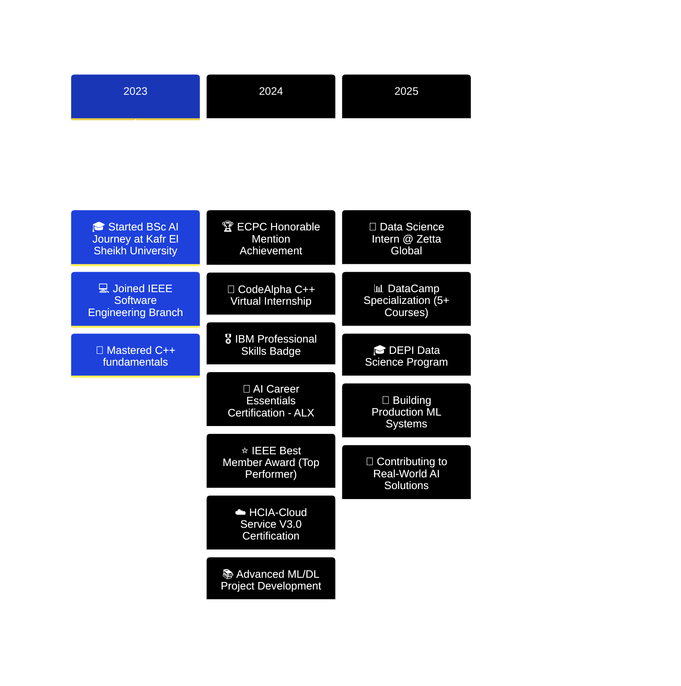

<div align="center">

<!-- Holographic Header with Particles -->


<!-- Animated Matrix Rain Effect Banner -->
<picture>
  <source media="(prefers-color-scheme: dark)" srcset="https://user-images.githubusercontent.com/74038190/225813708-98b745f2-7d22-48cf-9150-083f1b00d6c9.gif">
  
</picture>

<!-- Cyber Typing Effect with Multiple Lines -->
<a href="https://git.io/typing-svg">
  
</a>

<!-- Futuristic Social Badges -->
<p align="center">
  <a href="https://linkedin.com/in/nadermohamed7">
    
  </a>
  <a href="mailto:naderelakany@gmail.com">
    
  </a>
  <a href="https://codeforces.com/profile/nader__7">
    
  </a>
  <a href="https://linktr.ee/nader__7">
    
  </a>
  <a href="https://www.kaggle.com/naderelakany">
    
  </a>
</p>

<!-- Live Visitor Counter with Gradient -->


</div>

---

<!-- Bio Section with Glassmorphism Effect -->
<div align="center">

##  WHO AM I?

</div>

<table width="100%">
<tr>
<td width="55%" valign="top">

```python
#!/usr/bin/env python3
"""
█▀▀▄ ▄▀▀▄ █▀▀▄ █▀▀ █▀▀▄   
█  █ █▄▄█ █  █ █▀▀ █▄▄▀   
▀  ▀ ▀  ▀ ▀▀▀  ▀▀▀ ▀ ▀▀
"""

class DataScientist:
    def __init__(self):
        self.name = "Nader Mohamed"
        self.role = "AI Engineer & Data Scientist"
        self.location = "🇪🇬 Desouk, Egypt"
        self.company = "Zetta Global"
        self.university = "Kafr El Sheikh University"
        self.year = "3rd Year AI Student"
        
    @property
    def current_stack(self):
        return {
            "languages": ["Python", "C++", "SQL"],
            "ml_frameworks": ["TensorFlow", "PyTorch", "Keras"],
            "data_tools": ["Pandas", "NumPy", "Scikit-learn"],
            "visualization": ["Matplotlib", "Seaborn", "Plotly"],
            "cloud": ["Huawei Cloud (HCIA Certified)"],
            "specialties": [
                "🧠 Deep Learning & Neural Networks",
                "👁️ Computer Vision",
                "📊 Predictive Analytics", 
                "🔍 Natural Language Processing",
                "⚡ Algorithm Optimization"
            ]
        }
    
    def current_mission(self):
        return [
            "🎯 Building production-grade ML pipelines @ Zetta Global",
            "🏗️ Architecting intelligent AI solutions",
            "📈 Converting data chaos into business gold",
            "🏆 Mastering competitive programming (CP)",
            "🌱 Growing from AI student → AI leader"
        ]
    
    def philosophy(self):
        return "Code is poetry. Data tells stories. AI changes lives."

# Initialize
nader = DataScientist()
print(f"👾 Welcome to {nader.name}'s Digital Universe!")
```

</td>
<td width="45%" valign="top">


### 🎓 EDUCATION
**BSc in Artificial Intelligence**  
📍 Kafr El Sheikh University  
📅 Sep 2023 - July 2027  

### 💼 CURRENT POSITION
**Data Science Intern**  
🏢 Zetta Global  
📅 July 2025 - Present  

### 🌟 QUICK STATS
- 🔥 **4+** Major AI Projects
- 📚 **8+** Professional Certifications
- 🏆 **ECPC 2024** Honorable Mention
- ⭐ **IEEE Best Member** Award
- ☁️ **HCIA-Cloud** Certified

</td>
</tr>
</table>

<div align="center">

</div>

---

<!-- Tech Stack with Neon Glow Effect -->
<div align="center">

##  TECH WEAPONRY


### 💻 **CORE LANGUAGES**
<p>


</p>

### 🤖 **AI/ML FRAMEWORKS**
<p>


</p>

### 📊 **DATA SCIENCE ARSENAL**
<p>


</p>

### 🛠️ **DEV TOOLS & PLATFORMS**
<p>


</p>

### ☁️ **CLOUD & DATABASE**
<p>


</p>

</div>

<div align="center">

</div>

---

<!-- Premium Project Showcase -->
<div align="center">

##  FLAGSHIP PROJECTS

</div>

<table width="100%">

<!-- Row 1: Horus AI & Stroke Prediction -->
<tr>
<td width="50%" valign="top">

<div align="center">

### 🔮 **Horus AI - Ancient Egyptian Recognition**


[](https://github.com/Nadercr7)
[](https://github.com/Nadercr7)
[](https://github.com/Nadercr7)

</div>

```yaml
🎯 Achievement: 80% Accuracy
🔬 Technology: CNN + Transfer Learning
🤖 AI Integration: Google Gemini API
```

**🚀 KEY HIGHLIGHTS:**
- 🏛️ Identifies ancient Egyptian artifacts using deep learning
- 🧠 Custom CNN architecture with transfer learning
- 💬 Interactive AI chatbot for historical context
- 🌐 Full-stack Flask web application
- 📸 Real-time image classification
- 🎨 Modern responsive UI/UX

**💡 IMPACT:** Revolutionizing archaeology with AI-powered artifact recognition

---

</td>

<td width="50%" valign="top">

<div align="center">

### 🧠 **Cerebral Stroke Prediction System**


[](https://github.com/Nadercr7)
[](https://github.com/Nadercr7)
[](https://github.com/Nadercr7)

</div>

```yaml
🎯 Achievement: 85% Accuracy
🔬 Algorithms: Logistic Regression + KNN
⚖️ Feature: Class Imbalance Handling
```

**🚀 KEY HIGHLIGHTS:**
- 🏥 Medical-grade stroke risk prediction
- 📊 Custom logistic regression from scratch
- 🎯 Advanced KNN implementation
- ⚖️ SMOTE for class imbalance
- 💻 Interactive tkinter GUI
- 📈 Real-time risk assessment dashboard

**💡 IMPACT:** Saving lives through predictive healthcare analytics

---

</td>
</tr>

<!-- Row 2: Sentiment Analysis & Movie Analytics -->
<tr>
<td width="50%" valign="top">

<div align="center">

### 💬 **Sentiment Alignment Analysis**


[](https://github.com/Nadercr7)
[](https://github.com/Nadercr7)
[](https://github.com/Nadercr7)

</div>

```yaml
🎯 Dataset: Amazon Reviews (10K+)
🔬 Model: Multilingual BERT
📊 Analysis: Sentiment-Rating Correlation
```

**🚀 KEY HIGHLIGHTS:**
- 🌍 Multilingual BERT implementation
- ⭐ Star rating vs sentiment alignment
- 📊 Advanced data visualization
- 📈 Statistical correlation analysis
- 📋 Comprehensive CSV reporting
- 🔍 Pattern discovery in customer feedback

**💡 IMPACT:** Understanding customer sentiment at scale for business intelligence

---

</td>

<td width="50%" valign="top">

<div align="center">

### 🎬 **Movies Dataset Analytics**


[](https://github.com/Nadercr7)
[](https://github.com/Nadercr7)
[](https://github.com/Nadercr7)

</div>

```yaml
🎯 Dataset: 10,000+ Movies
⚡ Optimization: 20% Query Speed Boost
💰 Discovery: 15% Actor-Revenue Link
```

**🚀 KEY HIGHLIGHTS:**
- 📊 Big data analysis pipeline
- ⚡ SQL query optimization (20% faster)
- 💰 Revenue prediction models
- 🎭 Actor influence on profitability
- 📈 Trend analysis & visualization
- 🔍 Success factor identification

**💡 IMPACT:** Data-driven insights for entertainment industry strategy

---

</td>
</tr>

</table>

<div align="center">

</div>

---

<!-- GitHub Statistics Dashboard -->
<div align="center">

##  GITHUB ANALYTICS DASHBOARD

<!-- Snake Animation -->
<picture>
  <source media="(prefers-color-scheme: dark)" srcset="https://raw.githubusercontent.com/Nadercr7/Nadercr7/output/github-contribution-grid-snake-dark.svg">
  <source media="(prefers-color-scheme: light)" srcset="https://raw.githubusercontent.com/Nadercr7/Nadercr7/output/github-contribution-grid-snake.svg">
  
</picture>

<br/><br/>

<!-- Stats Grid -->
<table width="100%">
<tr>
<td width="50%">


</td>
<td width="50%">


</td>
</tr>

<tr>
<td width="50%">


</td>
<td width="50%">


</td>
</tr>
</table>

<!-- Contribution Stats -->


</div>

<div align="center">

</div>

---

<!-- Achievements Gallery -->
<div align="center">

##  ACHIEVEMENTS & CERTIFICATIONS


</div>

<table width="100%">

<!-- Row 1 -->
<tr>
<td align="center" width="25%">

<br/>
<strong>🏆 HCIA-Cloud Service</strong>
<br/>
<sub>Huawei Certified</sub>
<br/>
<sub>December 2024</sub>
<br/>

</td>

<td align="center" width="25%">

<br/>
<strong>🥉 ECPC 2024</strong>
<br/>
<sub>Honorable Mention</sub>
<br/>
<sub>July 2024</sub>
<br/>

</td>

<td align="center" width="25%">

<br/>
<strong>📊 DataCamp Pro</strong>
<br/>
<sub>5+ Courses Completed</sub>
<br/>
<sub>2025</sub>
<br/>

</td>

<td align="center" width="25%">

<br/>
<strong>⭐ IEEE Best Member</strong>
<br/>
<sub>Software Engineering</sub>
<br/>
<sub>2024</sub>
<br/>

</td>
</tr>

<!-- Row 2 -->
<tr>
<td align="center">

<br/>
<strong>🤖 AI Career Essentials</strong>
<br/>
<sub>ALX × AICE</sub>
<br/>
<sub>August 2024</sub>
<br/>

</td>

<td align="center">

<br/>
<strong>💼 IBM Professional Skills</strong>
<br/>
<sub>Critical Thinking Badge</sub>
<br/>
<sub>May 2024</sub>
<br/>

</td>

<td align="center">

<br/>
<strong>💻 CodeAlpha Internship</strong>
<br/>
<sub>C++ Programming</sub>
<br/>
<sub>July - August 2024</sub>
<br/>

</td>

<td align="center">

<br/>
<strong>🎓 DEPI Program</strong>
<br/>
<sub>Data Science Track</sub>
<br/>
<sub>2025</sub>
<br/>

</td>
</tr>

</table>

<div align="center">

</div>

---

<!-- Professional Experience Timeline -->
<div align="center">

##  PROFESSIONAL JOURNEY

</div>



<details open>
<summary><b>💼 Data Science Intern - Zetta Global</b> | <i>July 2025 - Present</i></summary>
<br/>

<table>
<tr>
<td width="50%">

**🎯 ROLE & RESPONSIBILITIES:**
- 🏗️ Building production-grade data pipelines
- 🤖 Deploying ML models to production
- 📊 Creating business intelligence dashboards
- 🔍 Performing advanced data analysis
- 🤝 Collaborating with cross-functional teams

</td>
<td width="50%">

**💡 KEY ACHIEVEMENTS:**
- ⚡ Applied cutting-edge ML techniques
- 📈 Contributing to data-driven decisions
- 🎓 Learning from senior data scientists
- 🚀 Real-world problem-solving experience
- 💼 Professional workflow mastery

</td>
</tr>
</table>

</details>

<details>
<summary><b>🎓 DEPI Data Science Program</b> | <i>2025</i></summary>
<br/>

<table>
<tr>
<td width="50%">

**📚 SPECIALIZATION AREAS:**
- 🧹 Advanced data cleaning & preprocessing
- 🔍 Exploratory data analysis (EDA)
- 📊 Statistical analysis & hypothesis testing
- 📈 Professional visualization techniques
- 🛠️ Industry-standard tools & frameworks

</td>
<td width="50%">

**🎯 SKILLS ACQUIRED:**
- 🐍 Python for data science
- 📊 Pandas & NumPy mastery
- 📈 Data visualization best practices
- 🔬 Statistical modeling
- 💼 Real-world project experience

</td>
</tr>
</table>

</details>

<details>
<summary><b>🏆 IEEE Software Engineering - Best Member</b> | <i>2024</i></summary>
<br/>

<table>
<tr>
<td width="50%">

**🌟 CONTRIBUTIONS:**
- 💻 Advanced C++ programming
- 🧩 Complex algorithmic problem-solving
- 🤝 Team leadership & mentoring
- 📚 Technical workshops & presentations
- 🎯 Community engagement & growth

</td>
<td width="50%">

**🏅 RECOGNITION:**
- ⭐ **Best Member Award** for outstanding contributions
- 🚀 Led multiple coding sessions
- 💡 Mentored junior members
- 🎤 Delivered technical talks
- 🌟 Built collaborative culture

</td>
</tr>
</table>

</details>

<details>
<summary><b>📚 Other Experiences</b></summary>
<br/>

**💻 Microsoft Learn Machine Learning Member**
- 📖 Expanded ML knowledge and applications
- 🎯 Completed advanced ML modules
- 🤖 Hands-on ML project development

**🏆 ACPC Kafr Elsheikh Club**
- 💡 Active in coding challenges
- 🧩 Problem-solving competitions
- 🤝 Collaborative learning environment

</details>

<div align="center">

</div>

---

<!-- Skills Breakdown -->
<div align="center">

##  CORE COMPETENCIES

</div>

<table width="100%">
<tr>
<td width="50%" valign="top">

### 💻 **TECHNICAL EXPERTISE**

**Programming Languages:**
```yaml
Python:     ████████████████████ 95%
C++:        ████████████████░░░░ 85%
SQL:        ███████████████░░░░░ 80%
HTML/CSS:   ██████████████░░░░░░ 75%
```

**Machine Learning & AI:**
- 🎯 Supervised Learning (Regression, Classification)
- 🔄 Unsupervised Learning (Clustering, Dimensionality Reduction)
- 🧠 Deep Learning (CNNs, RNNs, Transformers)
- 👁️ Computer Vision (Image Classification, Object Detection)
- 💬 Natural Language Processing (BERT, Sentiment Analysis)
- 🛠️ Model Optimization & Hyperparameter Tuning

**Data Science Stack:**
- 📊 NumPy, Pandas, Matplotlib, Seaborn, Plotly
- 🔬 Statistical Analysis & Hypothesis Testing
- 📈 Data Visualization & Storytelling
- 🧹 Data Cleaning & Preprocessing
- 📉 Exploratory Data Analysis (EDA)

</td>
<td width="50%" valign="top">

### 🎨 **SOFT SKILLS & TOOLS**

**Professional Skills:**
```yaml
Problem Solving:    ████████████████████ 98%
Fast Learning:      ███████████████████░ 95%
Communication:      ██████████████████░░ 90%
Teamwork:           ███████████████████░ 95%
Time Management:    ██████████████████░░ 90%
```

**Development Tools:**
- 🔧 Git & GitHub (Version Control)
- 📓 Jupyter Notebook & Google Colab
- 💻 VS Code, CLion, PyCharm
- 🐧 Linux Command Line
- 🐳 Docker (Basics)
- 🌐 Flask (Web Development)

**Other Skills:**
- 📋 Data Entry & Documentation
- 📊 Microsoft Office Suite (Excel, Word, PowerPoint)
- 📄 PDF/Document Processing
- 🖥️ GUI Development (tkinter)
- 🔌 API Integration & Development
- ☁️ Cloud Computing Fundamentals (HCIA Certified)

</td>
</tr>
</table>

<div align="center">

</div>

---

<!-- Connect & Collaborate Section -->
<div align="center">

##  LET'S BUILD THE FUTURE TOGETHER


### 🌐 **CONNECT WITH ME**

<p align="center">
  <a href="https://linkedin.com/in/nadermohamed7">
    
  </a>
  <a href="mailto:naderelakany@gmail.com">
    
  </a>
  <a href="https://codeforces.com/profile/nader__7">
    
  </a>
</p>

<p align="center">
  <a href="https://www.kaggle.com/naderelakany">
    
  </a>
  <a href="https://linktr.ee/nader__7">
    
  </a>
  <a href="https://github.com/Nadercr7">
    
  </a>
</p>

### 📞 **CONTACT INFORMATION**

<table align="center">
<tr>
<td align="center">

<br/>
<strong>Email</strong>
<br/>
<code>naderelakany@gmail.com</code>
</td>
<td align="center">

<br/>
<strong>Phone</strong>
<br/>
<code>+20 108 012 2169</code>
</td>
<td align="center">

<br/>
<strong>Location</strong>
<br/>
<code>Desouk, Egypt 🇪🇬</code>
</td>
</tr>
</table>

### 🌟 **LANGUAGES**

<table align="center">
<tr>
<td align="center" width="50%">

<br/>
<strong>Arabic</strong>
<br/>
<sub>Native Speaker</sub>
<br/>
<code>████████████████████ 100%</code>
</td>
<td align="center" width="50%">

<br/>
<strong>English</strong>
<br/>
<sub>Intermediate</sub>
<br/>
<code>██████████████░░░░░░ 75%</code>
</td>
</tr>
</table>

</div>

<div align="center">

</div>

---

<!-- Trophy Case -->
<div align="center">

##  TROPHY CABINET


</div>

<div align="center">

</div>

---

<!-- Quote of the Day -->
<div align="center">

## 💭 **DAILY INSPIRATION**


<br/>


### 🎯 **CURRENT GOALS**

```python
goals_2025 = {
    "🎓 Education": "Excel in AI program & graduate with honors",
    "💼 Career": "Master production ML systems @ Zetta Global",
    "🏆 Competitive": "Reach Expert level on Codeforces",
    "📚 Learning": "Deep dive into MLOps & Cloud Architecture",
    "🚀 Projects": "Build 5+ impactful open-source AI projects",
    "🤝 Community": "Mentor 50+ aspiring AI engineers"
}

for goal, target in goals_2025.items():
    print(f"{goal} → {target}")
```

### ⚡ **FUN FACTS ABOUT ME**

```markdown
🎮 When I'm not coding, I'm solving algorithmic puzzles
🧠 I think in Python and dream in data structures
☕ Powered by coffee and a passion for AI
🌙 Night owl - best code is written at 2 AM
🎯 Obsessed with optimizing everything (even my morning routine!)
📚 Currently reading: "Deep Learning" by Ian Goodfellow
🎵 Coding soundtrack: Lo-fi beats + focus music
🌍 Goal: Use AI to solve real-world problems
```

</div>

<div align="center">

</div>

---

<!-- Footer Section -->
<div align="center">

### 💼 **OPEN TO OPPORTUNITIES**


<h3>
🚀 Available for:
<br/>
<code>Full-Time Roles</code> | <code>Internships</code> | <code>Freelance Projects</code> | <code>Collaborations</code>
</h3>

**Interested in AI/ML, Data Science, or Software Engineering positions**

<br/>

### ⭐ **IF YOU LIKE MY WORK, DROP A STAR ON MY REPOS!**


<br/>

### 📊 **PROFILE STATISTICS**

<table align="center">
<tr>
<td align="center">

</td>
<td align="center">

</td>
<td align="center">

</td>
</tr>
</table>

<br/>

---

<h3>
💡 "In the world of AI, we don't just write code - we sculpt intelligence."
<br/>
<sub>- Nader Mohamed</sub>
</h3>

<br/>


<br/><br/>

**Made with** ❤️ **and lots of** ☕ **by Nader Mohamed**

<sub>Last Updated: October 2025 | Built with passion for AI & Data Science</sub>

<br/>

</div>

<!-- Final Wave Footer -->


</div>
